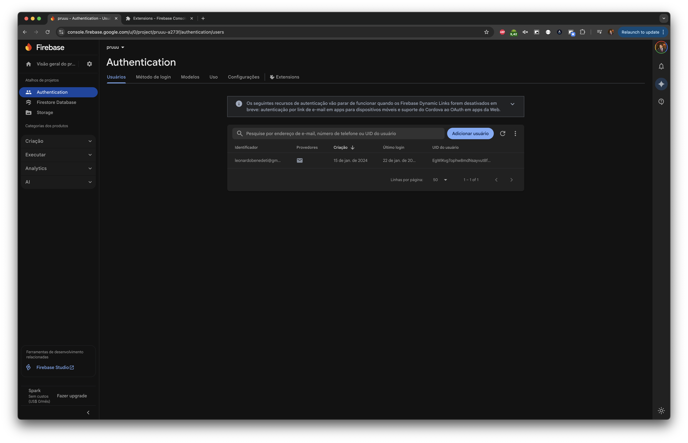
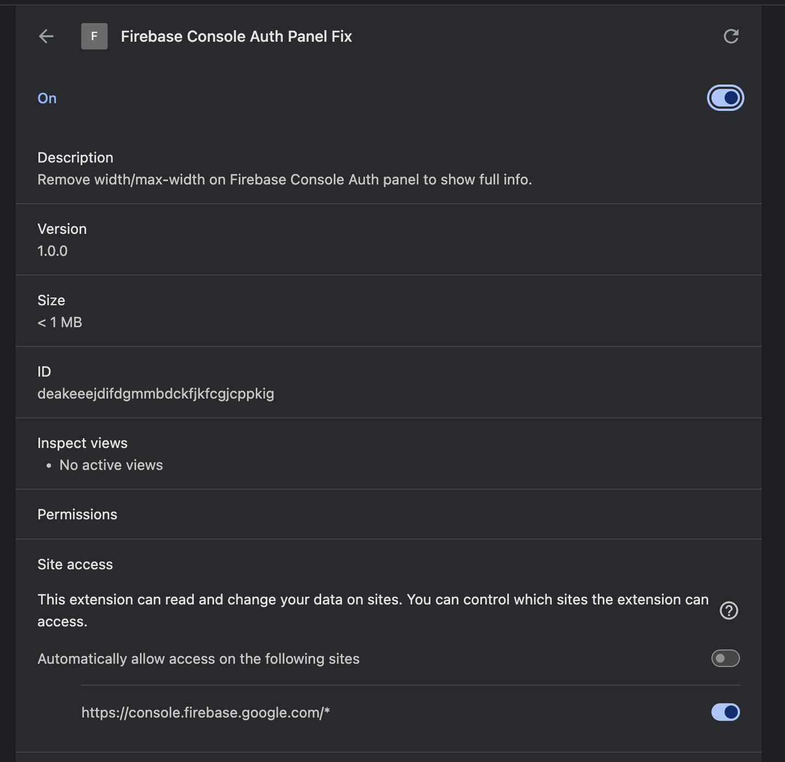

# Firebase Console Auth Panel Fix (Chrome - Unpacked)

**O que faz:** injeta CSS no console.firebase.google.com para remover `width` e `max-width` que comprimem o painel de Auth.

### Antes

### Instalação da extensão

### Resultado

